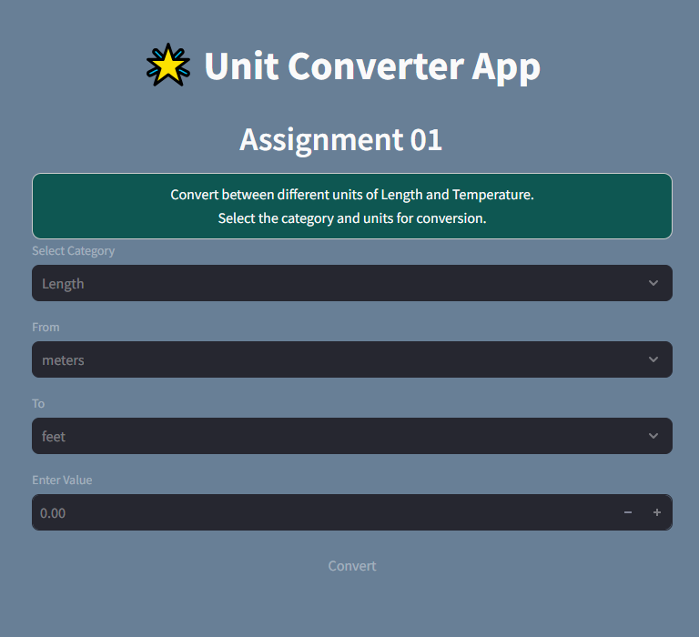

# 📌 Unit Converter App

## **Introduction**
Welcome to the **Unit Converter App**, a simple yet professional tool built using **Streamlit** in Python.  
This project is designed to help students and developers understand the **best practices** of writing **clean, structured, and well-documented code**.  

As a **Final Year BS Software Engineering Student**, I have implemented this project with a focus on:
- Writing **efficient and modular code**.
- Using **lambda functions** and **conversion logic** effectively.
- Implementing a **professional UI** with **Streamlit**.
- Ensuring the app is **user-friendly** and **error-free**.

Whether you’re a beginner or an advanced coder, this app will help you understand **unit conversions** while following **best coding practices**.  

---

## 🔹 **Features**
- ✅ Interactive **Streamlit UI**
- ✅ Supports **Length** and **Temperature** conversions
- ✅ Uses **lambda functions** for mathematical calculations (You Can Search and read it's docsfor more understanding) 

---

## 🔹 **Installation**
To run this app, make sure you have **Python** installed. Then, follow these steps:

1️⃣ Install Streamlit:
```sh
pip install streamlit

streamlit run UnitConverterApp.py

## 🔹 **Usage**
Select a conversion category (Length or Temperature).
Choose the input unit and output unit.
Enter the value you want to convert.
Click Convert to see the result.

## 🔹 **Code Explanation**
The app is built using Streamlit for a web-based interface.
The conversion formulas are implemented using lambda functions for better efficiency.

## 🔹 **Screenshots**


## 🔹 Contributing
If you would like to contribute:

Fork the repository.
Make improvements.
Create a Pull Request.
